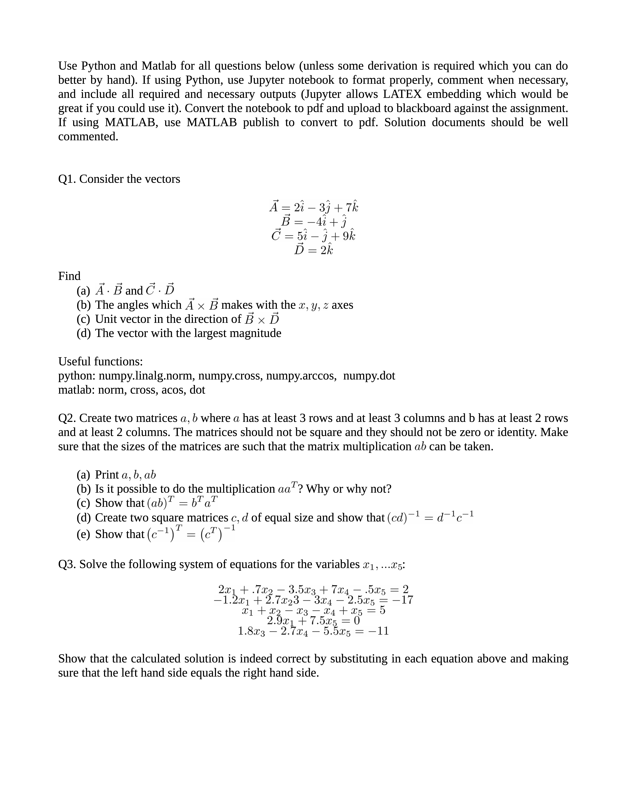

# Assignment 01

## 06/11/2020

## Objectives

1. Learn Matrices.
2. Fundamental Matrix operations.
3. Solving linear equations using Matrices.

Use Python and Matlab for all questions below (unless some derivation is required which you can do
better by hand). If using and include all required great if you could use it). If using MATLAB, use commented.

