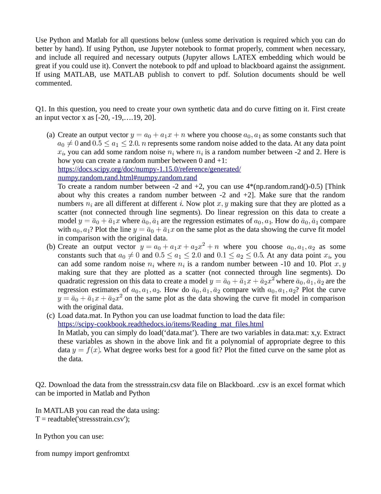
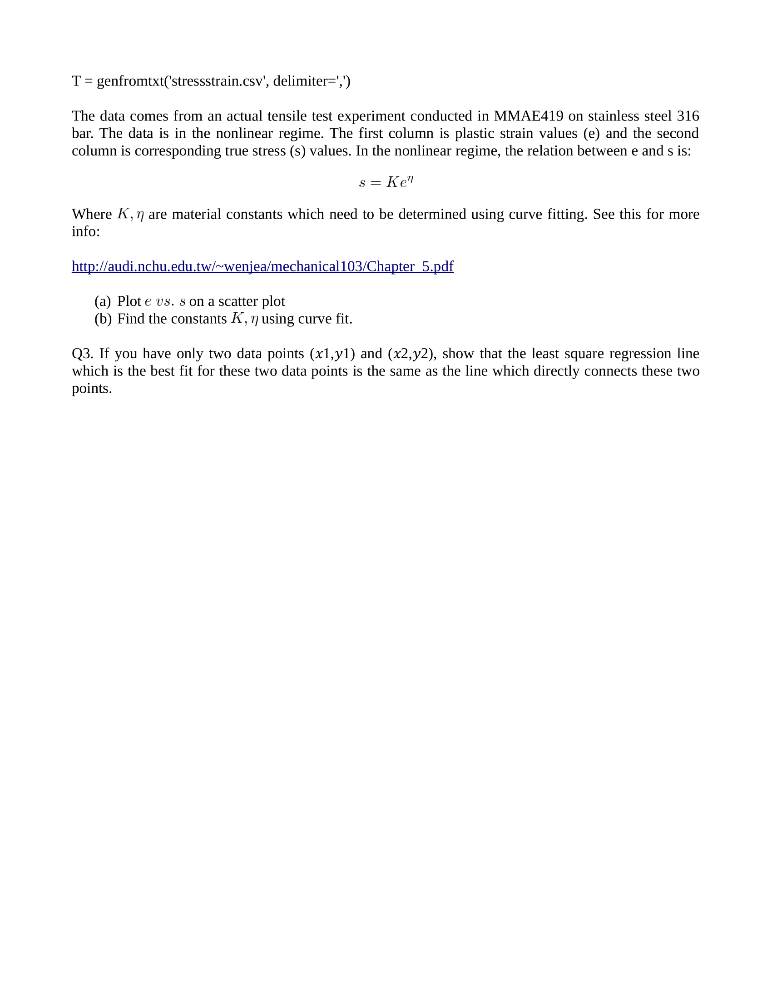

# Assignment 04

## 07/02/2020

## Objectives

1. Note: This project requires files included in the data folder. 
2. Make sure to download it and import under the same folder.  
3. Randomization of values and adding noises to Eigen equations.  
4. Plain stress, Shear stress, Elasticity and Young's Modulus.
5. Tensile Properties of stainless steel 316.
6. Graphing and Plotting actual sample data. 

Use Python and Matlab for all questions below (unless some derivation is required which you can do
better by hand). If using and include all required great if you could use it). If using MATLAB, use commented.

