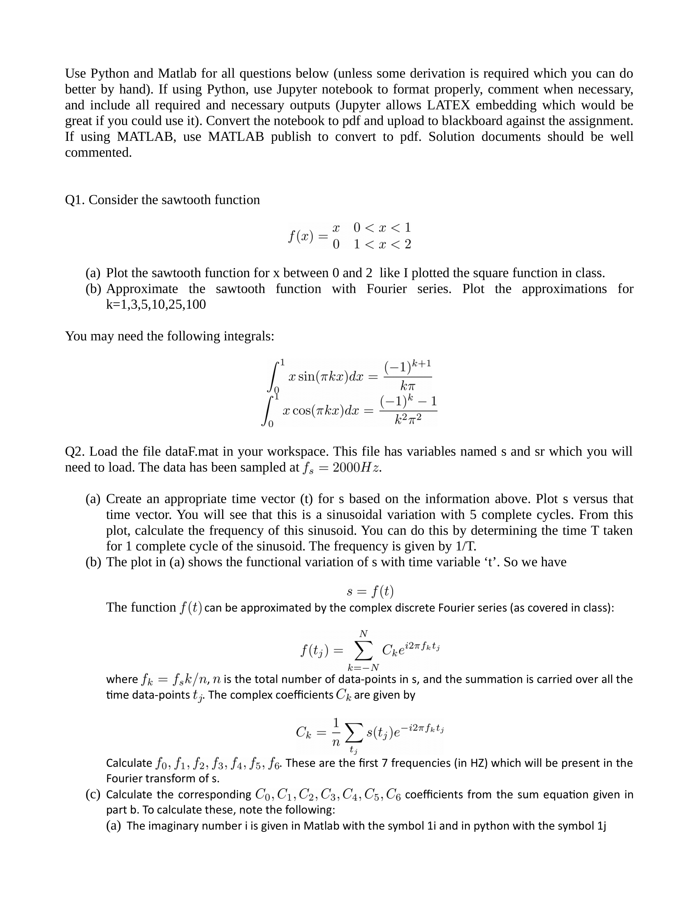
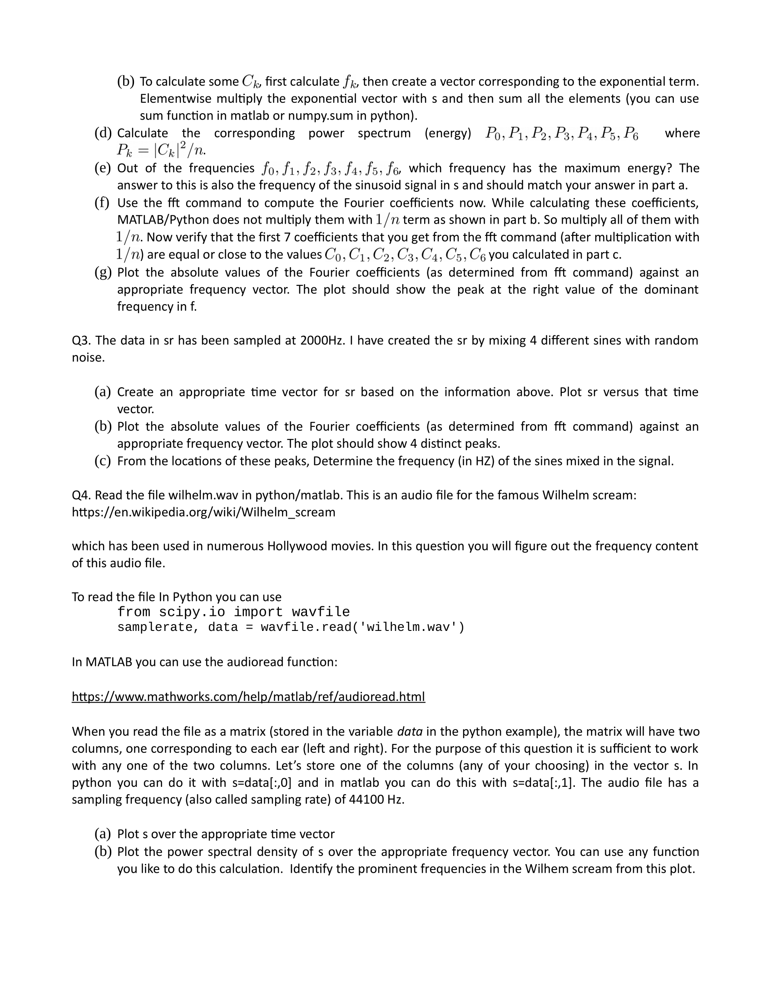

# Assignment 05

## 07/09/2020

## Objectives

1. Note: This project requires files included in the data folder. 
2. Make sure to download it and import under the same folder.  
3. Audio and Frequency processing.  
4. Integration of Sawtooth functions.
5. Fourier transformation.
6. Power and Energy spectrum. 
7. Discrete mathematical functions. 

Use Python and Matlab for all questions below (unless some derivation is required which you can do
better by hand). If using and include all required great if you could use it). If using MATLAB, use commented.

