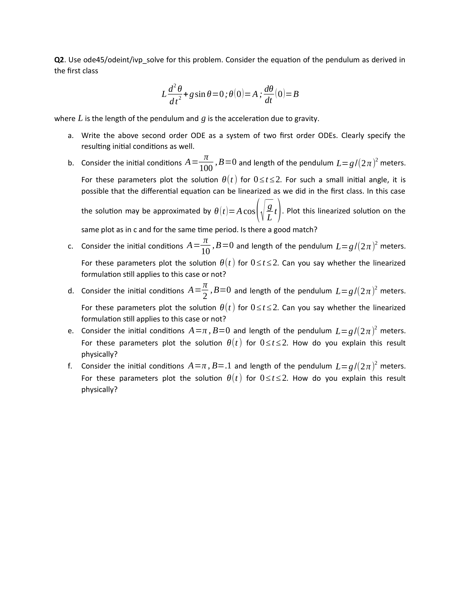

# Assignment 06

## 07/16/2020

## Objectives

1. Note: This project requires files included in the data folder. 
2. Make sure to download it and import under the same folder.  
3. Higher order derivatives.  
4. Engineering applications.
5. Taylor Series and Sail functions.
6. The pendulum problem. 
7. The FA-18 Jet Engine analysis.

Use Python and Matlab for all questions below (unless some derivation is required which you can do
better by hand). If using and include all required great if you could use it). If using MATLAB, use commented.

